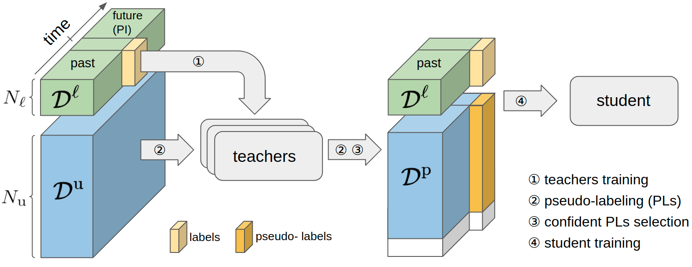

# `T-Concord3D` Teachers in concordance for pseudo-labeling of 3D sequential data 

 `T-Concord3D` The source code of our work **Teachers in concordance for pseudo-labeling of 3D sequential data**

Proposed Concordance of teachers for pseudo-
labeling of sequences. A set Dℓ of sequences with central
frame labeled, and a larger set Du of unannotated ones, are
available for training; 1⃝ Multiple offline teachers are trained
with full supervision on Dℓ, each with a different temporal
range towards future and past frames; 2⃝ The teachers are
run on Du to produce pseudo-labels (PLs) for central frames;
3⃝ Sequences with the most confident PLs according to
Concordance of teachers are selected, forming the pseudo-
labeled set Dp. The white box depicts the discarded PLs; 4⃝
The student is trained on Dℓ ∪ Dp, to work online with past and current frames only.

## Installation

### Requirements
- PyTorch >= 1.7
- [torch-scatter](https://github.com/rusty1s/pytorch_scatter)
- [spconv](https://github.com/traveller59/spconv) (tested with spconv==2.0 and cuda==11.0)

## Data Preparation

### SemanticKITTI
The dataset consists of 22 sequences with a split of sequences from 00 to 10 for training
(08 is reserved for validation) and from 11 to 21 for testing.
The dataset has two challenges, namely single-scan with only
19 class categories, and multi-scan with 25 class categories,
including 19 from single-scan and 6 moving-object categories.
For this experiment, we cut each training sequence (00 - 10, except 08) into two parts, the
first 20% for human-labeled dataset Dℓ and the latter 80% for
unlabeled dataset Du as shown bellow.
```
./	 
├── ...
└── path_to_data_shown_in_config/
    ├──Labeled-sequences (20% training sequence (00 - 10) for training sufexted with '20')
    │    ├── 0020/    #training
    │    │   ├── velodyne/	
    │    │   │	├── 000000.bin
    │    │   │	├── 000001.bin
    │    │   │	└── ...
    │    │   ├── labels/ 
    │    │   │   ├── 000000.label
    │    │   │   ├── 000001.label
    │    │   │   └── ...
    │    │   ├── calib.txt
    │    │   ├── poses.txt
    │    │   └── times.txt
    │    ├── 0120 ...
    │    │   └── ...
    │    ├── 1020/
    │    │   └── ...
    │    │
    │    └── 08/ # for validation
    │        ├── velodyne/	
    │        │	├── 000000.bin
    │        │	├── 000001.bin
    │        │	└── ...
    │        ├── labels/ 
    │        │   ├── 000000.label
    │        │   ├── 000001.label
    │        │   └── ...
    │        ├── calib.txt
    │        ├── poses.txt
    │        └── times.txt
    └──Unlabeled-sequences (80% training sequence (00 - 10) for pseudo-labeling sufexted with '80')
        ├── 0080/   # 0080 - 1080 for pseudo-labeling
        │   ├── velodyne/	
        │   │	├── 000000.bin
        │   │	├── 000001.bin
        │   │	└── ...
        │   ├── calib.txt
        │   ├── poses.txt
        │   └── times.txt
        ├── 0180 ...
        │   └── ...
        └── 1080/
            └── ...
```

### WOD
- Coming soon
```
./
├── 
├── ...
└── path_to_data_shown_in_config/
		├──Training
		│    └──sequences (...)
		├──Validation
		│    └──sequences (...)
		└──Testing
		     └──sequences (...)

```

## Training
### Training Teacher models with access to future frame (Privileged Information)
1. modify the config/semantickitti/semantickitti_T3_3_s20.yaml with your custom settings. We provide a sample yaml for SemanticKITTI multi-frame (both past and future) aggregation
2. train the network by running 
   ```
   sh script/sematickitti/run_train_T3_3_s20.sh
   ```

### Generate Concordance of Teachers using a set of teachers with access to different future frame (Privileged Information) temporal window 
- e.g.  \mathcal{T}^{1, ... ,3 } = {T-1,1, T-2,2, T-3,3},
1. generate pseudo labels for the 80/% unlabeled data using the trained Teacher models (e.g., T-1_1, T-2_2, T-3_3) 
   - run 
   ```
   sh script/sematickitti/run_infer_T3_3_s20.sh
   ```
2. generate concordance of teachers
   - run 
   ```
   sh script/sematickitti/generate_T_concord.sh
   ```

### Training Student models with distilled knowledge form Concordance of teachers
1. modify the config/semantickitti/semantickitti_S0_0_T11_33_ssl_s20_p80.yaml with your custom settings. We provide a sample yaml for SemanticKITTI multi-frame (both past and future) aggregation
2. train the network by running 
   ```
   sh script/sematickitti/run_train_f0_0_T11_33_ssl_s20_p80.sh
   ```

## Testing
1. modify the config/semantickitti/semantickitti_S0_0_T11_33_ssl_s20_p80.yaml with your custom settings. We provide a sample yaml for SemanticKITTI multi-frame (both past and future) aggregation
2. train the network by running 
   ```
   sh script/sematickitti/run_test_S0_0_T11_33_ssl_s20_p80.sh
   ```

### Pretrained Models
-- Pretrained model for SemanticKITTI (soon)

-- For Waymo Open Dataset (WOD), please refer to [WOD-GUIDE](./WOD-GUIDE.md)


## TODO List
- [x] Provided Inference/test code for submission to leaderboard SemanticKITTI.
- [x] Support Future-frame supervision semantic segmentation.
- [x] Support Concordance of Teachers with Privilege Information.
- [X] Support Knowledge Distillation on single-frame and multi-frame semantic segmentation .
- [ ] Release pretrained model for semanticKITTI.
- [ ] Release data preparation code.
- [ ] Integrate Teachers in Concordance for LiDAR 3D Object Detection into the codebase.
- [ ] Release pretrained model for WOD.

## Reference

If you find our work useful in your research, please consider citing our [paper](https://arxiv.org/abs/2207.06079):
```
@article{gebrehiwot2022teachers,
  title={Teachers in concordance for pseudo-labeling of 3D sequential data},
  author={Gebrehiwot, Awet Haileslassie and Vacek, Patrik and Hurych, David and Zimmermann, Karel and Perez, Patrick and Svoboda, Tom{\'a}{\v{s}}},
  journal={arXiv preprint arXiv:2207.06079},
  year={2022}
}
```

## Acknowledgments
- This work was supported in part by OP VVV MEYS funded project CZ.02.1.01/0.0/0.0/16 019/0000765 “Research Center for Informatics”, and by Grant Agency of the CTU Prague under Project SGS22/111/OHK3/2T/13. Authors want to thank Valeo company for a support.
- We thank for the opensource codebase, [Cylinder3D](https://github.com/xinge008/Cylinder3D) and [spconv V2.0](https://github.com/traveller59/spconv)
